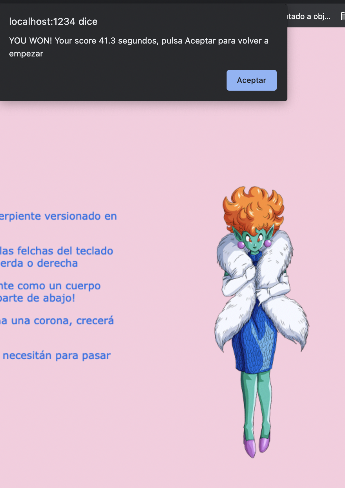
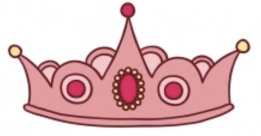

# PrincessSnake

- [PrincessSnake](#princesssnake)
- [Imagenes y vídeos](#imagenes-y-vídeos)
- [Motivación del proyecto](#motivación-del-proyecto)
- [Logros conseguidos](#logros-conseguidos)
- [Estructura del Proyecto](#estructura-del-proyecto)
- [Acceso al juego](#acceso-al-juego)
- [Manual de instalación](#manual-de-instalación)
- [Ejemplos de código](#ejemplos-de-código)
- [Recursos útiles](#recursos-útiles)
- [Listado de paquetes y dependencias](#listado-de-paquetes-y-dependencias)
- [Agradecimientos](#agradecimientos)

# Imagenes y vídeos

# Motivación del proyecto
Juego basado en la serpiente del nokia3310.
Mi motivación es crear un juego que nos recuerdo a muchos de nosotros a la infancia, quiero darle un plus y poder personalizar la serpiente. En este caso se trata de Princess Snake de Dragon Ball, pero pensando más allá, la serpiente podría personalizarse en disintos personajes de juegos y dibujos famosos.
La serpeinte irá comiendo coronas de princesa que le harán crecer, desde el inicio un cronómetro comenzará a correr el tiempo, cuando te comas las coronas necesarias para pasar el juego habrás ganado y una pantalla te indicará tu puntuación.

# Logros conseguidos
Consideró este punto importante para animar a otros a seguir mejorando en código. Cuando abrí por primera vez mi canvas, no sabía por dónde empezar, ni si quiera conseguía hacer dos cuadrados distintos como yo quería... después de una semana y media centrada en el proyecto he conseguido:

* Ejecutar un proyecto desde `NodeJS`, usar el lengujae `typescript`, implentar `paquete yarn` y `ejecutar html desde parcel`
* Subir todo el proyecto a Github y llevar a cabo todo lo necesario para que Github Pages pueda ejectuar.
* LLevar a cabo mi primer CanvasRenderingContext2S
* Generar un cuadrado con el método ctx.fillRect que vaya creciendo representando una serpiente.
* Generar un cuadrado que acabe siendo el sprite corona.
* Generar colisión entre serpiente y coronas.
  * En este punto conocí el método math.floor para medir la distancia entre la serpiente y la corona
* Conocer la librería lodash, gracias a la cual conseguí que las coronas se desplazarán aleatoriamente cada vez que "la serpiente se las come".
* Generar un cronómetro que una vez el jugador finaliza la partida le dice el tiempo que ha tardado.
* Generar el metodo alert como cuadro de alerta que indica que has pasado el juego y con un botón aceptar que permite volver a jugar.
  
# Estructura del Proyecto
Mi proyecto se estructura en diferentes carpetas y un único html.
Carpetas:
* img: con las imagenes utilizadas en el proyecto
* public: hojas de estilo
* src: contiene todos los archivos TS divididos por distintas carpetas: 
  * actors: actores del proyecto: archivo actors genérico.ts, snake.ts, crown.ts, chrono.ts y FPSViewer.ts
  * assets: imagen coronas
  * state: GameManager.ts: ejecuta eventos del juego
  * types: Points.ts: posicion de los actores en el mapa
  * utils: AngleToRad.ts (archivo que finalmente no he utilizado pero lo dejo por posibles mejoras más adelante) y checklimits.ts
  * Script.ts dónde se entrelazan todos los archivos.

# Acceso al juego

Puedes jugar pinchando el siguiente enlace : [Juega aquí](https://almuperez.github.io/princess-snake-project/)

# Manual de instalación 

Para ejecutar con parcel sigue los siguientes pasos

* Primer paso: clonar el siguiente repositorio en la terminal
  
  * git clone https://github.com/Almuperez/princess-snake-project.git
  
* Segundo paso: generar una carpeta `cd proyecto_canvas`
  
* Tercer paso: 
* 
  Ejecutar en la terminal los siguientes comandos en el orden indicado 
  ~~~
  yarn init -y
  yarn isntall
  yarn run dev
  ~~~

Para desplegar y actualiar verisiones en ghPages: `yarn run ghbuild`

# Ejemplos de código

* [Sintáxis Spread](https://developer.mozilla.org/es/docs/Web/JavaScript/Reference/Operators/Spread_syntax)
~~~
let actors: Array<IActor> = [fps, snake, Manager, chrono, ...Manager.crowns]
~~~

* [Librería lodash](https://lodash.com/)
~~~
constructor(
    snake: IActor,
    initialPos: Point = { x: _.random(0, 500), y: _.random(0, 500) },
    size: Size = { w: 20, h: 20 }
  ) 
~~~ 
* [Colision y crecer serpiente, método math.floor](https://developer.mozilla.org/es/docs/Web/JavaScript/Reference/Global_Objects/Math/floor)

~~~
  update(delta: number) {
    let snakePos = this.snake.position;
    let crownPos = this.position;
    let distance = 0;
    if (snakePos) {
      distance = Math.sqrt(
        Math.pow(crownPos.x - snakePos.x, 2) +
          Math.pow(crownPos.y - snakePos.y, 2)
      );
    }

    if (Math.floor(distance) == 30) {
      this.position = { x: _.random(0, 500), y: _.random(0, 500) };
      Manager.addPoint();
      if (this.snake.growSnake) {
        this.snake.growSnake();
      }
    }
~~~

* Aumentar velocidad serpiente:
  ~~~
   growSnake() {
    const sizesnake = this.snakeSize;
    this.snakeSize = { w: sizesnake.w + 10, h: sizesnake.h };
    this.maxSpeed = this.maxSpeed * 1.005;
  }
  ~~~

# Recursos útiles
* Para llevar a cabo el canvas del juego entender la Api canvas: 
[Documentación Canvas API](https://developer.mozilla.org/es/docs/Web/API/Canvas_API)
* Sprites:
  

# Listado de paquetes y dependencias

* Juego ejecutado en enorno de ejecución NodeJS
* Gestor de dependencias utilizado: Yarn
* Para ejecutar el html: Parcel
* Lenguaje utilizado: Typescript
* Librerias utilizadas: Lodash
* Otras herramientas: eslint

# Agradecimientos
Quiero agradecer la enseñanza recibida por todo el equipo de Core School, así como el apoyo recibido en momentos críticos del proyecto a Marcos y Álvaro.
También me gustaría dar las gracias a mis compañeros, siempre atentos de nuestro chat en slack para resolver dudas y dar ánimos.
A mis amigos (en especial a Anna Hogberg por tantas conversaciones y ayuda, además de ser quién me impulso a esta aventura).
Y un GRACIAS enorme a mi familia, quién se ha organizado para que yo pudiera llevar a cabo de la mejor forma posible este proyecto y no ha dejado de animarme y ser los primeros fans de mi juego jeje.

