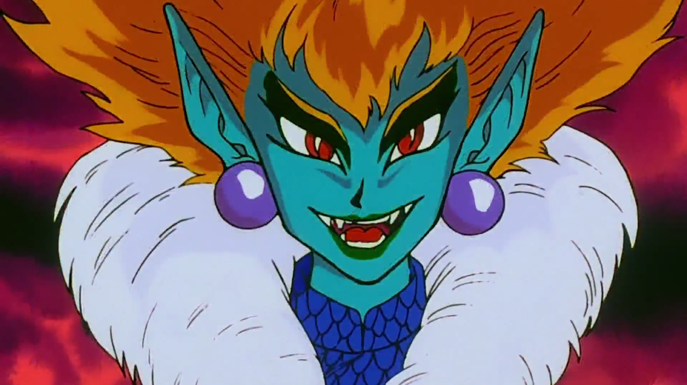

## PrincessSnake

- [PrincessSnake](#princesssnake)
- [Imagenes y vídeos](#imagenes-y-vídeos)
- [Motivación del proyecto](#motivación-del-proyecto)
- [Estructura del Proyecto](#estructura-del-proyecto)
- [Acceso al juego](#acceso-al-juego)
- [Manual de instalación](#manual-de-instalación)
- [Ejemplos de código](#ejemplos-de-código)
- [Entornos de ejecución](#entornos-de-ejecución)
- [Recursos útiles](#recursos-útiles)
- [Listado de paquetes y dependencias](#listado-de-paquetes-y-dependencias)
- [Estadísticas](#estadísticas)
- [Licencias](#licencias)
- [Agradecimientos](#agradecimientos)
- [Otras consideraciones](#otras-consideraciones)

## Imagenes y vídeos
## Motivación del proyecto
Juego basado en la serpiente del nokia3310
Mi objetivo es llevar a cabo el famoso juego de la serpiente al que muchos de nosotros hemos jugado. 
La serpeinte irá comiendo coronas de princesa y a medida que come va creaciendo, si se encuentra con otro icono que no sea la corona y se lo come entonces pierdes, al igual que si se da con la pared.

## Estructura del Proyecto
## Acceso al juego

Link del proyecto : Link de proyecto : https://almuperez.github.io/princess-snake-project/

## Manual de instalación

git clone https://github.com/Almuperez/princess-snake-project.git
yarn init -y
yarn isntall
yarn run dev

## Ejemplos de código
## Entornos de ejecución
## Recursos útiles
Para llevar a cabo el canvas del juego entender la Api canvas: 
https://developer.mozilla.org/es/docs/Web/API/Canvas_API 
https://developer.mozilla.org/es/docs/Web/API/Canvas_API

## Listado de paquetes y dependencias
NodeJS
Yarn
Typescript
Eslint
Lodash
## Estadísticas
## Licencias
## Agradecimientos
## Otras consideraciones

